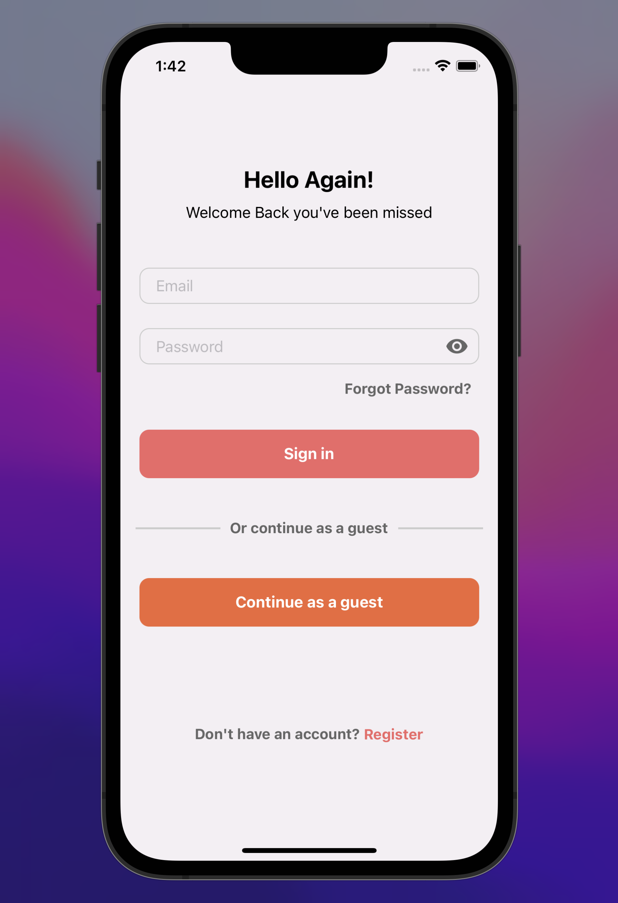

# MFN Mobile Application
MFN company connects freight forwarders of the Kingdom of Morocco with a wide range of tools designed for successful networking. This mobile application allows users to easily connect with other freight forwarders and access the tools and resources needed to successfully manage their business.

## Technologies Used
- React Native
- Expo
- React Native Maps
- Node.js
- Express.js
- MongoDB
- Mongoose

## Getting Started
- Fork and clone this repository.
- Run `npm install` to install all dependencies.
- Run `npx expo start` to start the application.
- Download the Expo app on your mobile device.
- Scan the QR code with your mobile device to view the application.

<!-- add screenshots here -->

## Screenshots

| Image 1 | Image 2 | Image 3 | Image 4 |
|---------|---------|---------|---------|
|  |  |  |  |  |  |  |  |